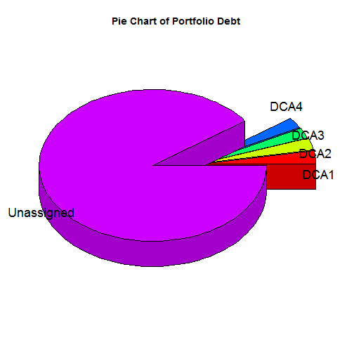

## Overview

This Shiny app is based on real data and shows:


* The performance of the assigned credit portfolio of a "bad" bank to debt collection agencies


* The performance of the unassigned portfolio


and remarks the differnce in performance.

--- .class #id 

## Shiny app

On the left side you can find a date field that takes date in a format "yyyy-mm"" because the performance gets reported monthly


Underneath the date field you can find detailed description of the fields used.


On the right side there is the barchart that shows the monthly performance. Each column represents the monthly payment ratio for each debt collection agency and the last column represents the peroformance of the unassigned portfolio, i.e. the part of the portfolio that clients pay without any notification.

--- .class #id 

## Field specs

DCA : Debt Collection Agency


     
PAY_RATIO : The percentage of assigned client payments to the assigned debt monthly


 
Unassigned : The unassigned segment of the bank porfolio. Cases that are not assigned to a DCA for debt collection  


--- .class #id

## Technical details


The data are loaded from a csv file uploaded on the server each time the app starts
```
    payments <- read.csv("payments1.csv", header=T)
```
The date field is reactive
```
    x <- reactive({as.yearmon(input$yearmonth)})
```
The plot is based on the lattice package
```
    output$newHist <- renderPlot({barchart(PAY_RATIO ~ EXTC_NAME,
    subset(payments,as.yearmon(REF_DATE)>=x() & as.yearmon(REF_DATE)<=x()),col='forestgreen')`
```      
There was a difficulty in using the date in yearmonth format, so the zoo package is loaded every time the app starts, in order to handle dates.

library(zoo)


--- .class #id

## Assigned debt pie chart for May 2014

As for today, only a small segment of the portfolio has been assigned:

 
**Thank you!**

